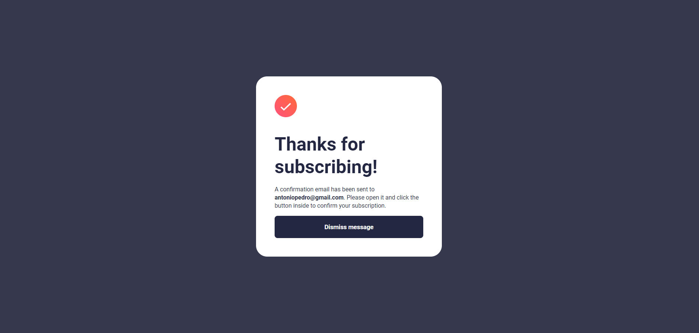

# Frontend Mentor - Newsletter sign-up form with success message solution

This is a solution to the [Newsletter sign-up form with success message challenge on Frontend Mentor](https://www.frontendmentor.io/challenges/newsletter-signup-form-with-success-message-3FC1AZbNrv). Frontend Mentor challenges help you improve your coding skills by building realistic projects.

## Table of contents

- [Overview](#overview)
  - [The challenge](#the-challenge)
  - [Screenshot](#screenshot)
  - [Links](#links)
- [My process](#my-process)
  - [Built with](#built-with)
  - [What I learned](#what-i-learned)
- [Author](#author)

## Overview

### The challenge

Users should be able to:

- Add their email and submit the form
- See a success message with their email after successfully submitting the form
- See form validation messages if:
  - The field is left empty
  - The email address is not formatted correctly
- View the optimal layout for the interface depending on their device's screen size
- See hover and focus states for all interactive elements on the page

### Screenshot




### Links

- Live Site URL: [URL here](https://antoniopedro04.github.io/newsletter-sign-up-form/)

## My process

### Built with

- Semantic HTML5 markup
- CSS custom properties
- Flexbox
- Mobile-first workflow
- Vanilla Javascript

### What I learned

It was a super fun experience making this project. It was the first time in a real project I used string methods and destructuring concepts to make the string verification work as a whole. Right below it can be seen one step of the verification that was necessary to be done.

```js
const hasConsecutiveDots = function (username) {
  for (const [i, char] of [...username].entries()) {
    if (char === '.') {
      if (username[i] === username[i + 1]) {
        return true;
      }
    }
  }
  return false;
};
```

Also, one big challenge was to make the website reponsive.

```css
@media ((min-width: 475px) and (max-width:630px)) {
  * {
    font-size: 95%;
  }

  ul {
    margin: 0;
  }
}

@media ((max-width: 474px)) {
  ul {
    margin: 0;
  }
  .submission-form {
    flex-direction: column-reverse;
    height: 700px;
    padding: 0;
    padding-bottom: 1rem;
  }

  .submission-form-information {
    width: 100%;
    min-height: 430px;
  }

  aside {
    background: url('assets/images/illustration-sign-up-mobile.svg') no-repeat
      center/cover;
    border-radius: 0;
    border-bottom-left-radius: 1rem;
    border-bottom-right-radius: 1rem;
  }
  h1 {
    margin-bottom: 0;
  }
}
```

## Author

- Github - [Antonio Rodrigues](https://github.com/AntonioPedro04)
